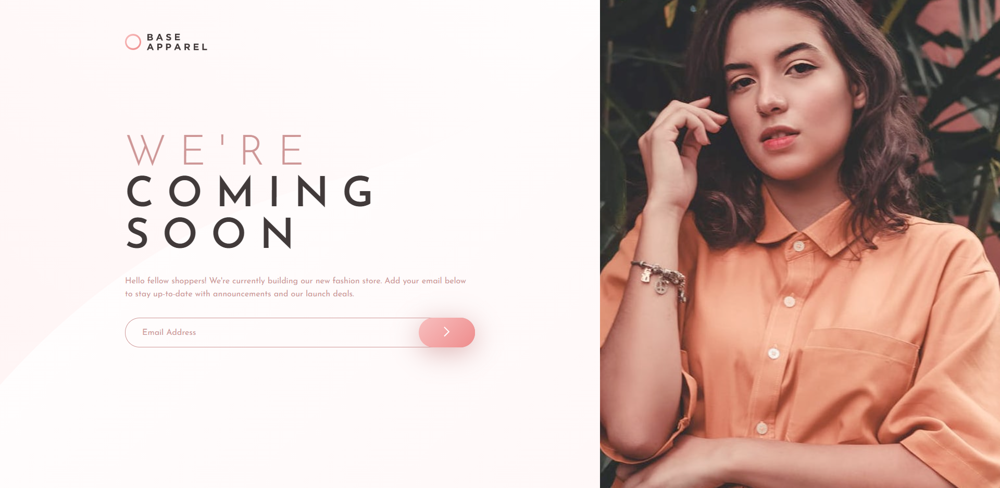

# Frontend Mentor - Base Apparel coming soon page solution

This is a solution to the [Base Apparel coming soon page challenge on Frontend Mentor](https://www.frontendmentor.io/challenges/base-apparel-coming-soon-page-5d46b47f8db8a7063f9331a0). Frontend Mentor challenges help you improve your coding skills by building realistic projects. 

## Table of contents

- [Overview](#overview)
  - [The challenge](#the-challenge)
  - [Screenshot](#screenshot)
  - [Links](#links)
- [My process](#my-process)
  - [Built with](#built-with)
  - [What I learned](#what-i-learned)
  - [Continued development](#continued-development)
- [Author](#author)

## Overview

### The challenge

Users should be able to:

- View the optimal layout for the site depending on their device's screen size
- See hover states for all interactive elements on the page
- Receive an error message when the `form` is submitted if:
  - The `input` field is empty
  - The email address is not formatted correctly

### Screenshot

### Links

- Solution URL: [https://www.frontendmentor.io/solutions/base-apparel-coming-soon-page-no-js-MtW-GP_Mq](https://www.frontendmentor.io/solutions/base-apparel-coming-soon-page-no-js-MtW-GP_Mq)
- Live Site URL: [https://hungry-cori-baa155.netlify.app/](https://hungry-cori-baa155.netlify.app/)

## My process

### Built with

- HTML5
- CSS
- Flexbox

### What I learned

- It's important to focus on creating a good HTML structure before adding CSS. 

- Also improved my understanding of Flexbox.

### Continued development

Keep on working with Flexbox.

## Author

- Website - [Yordan Hristov (Dantcho)](https://www.dantcho.com)
- Frontend Mentor - [@DantchoLV9](https://www.frontendmentor.io/profile/DantchoLV9)
- Twitter - [@DantchoLV9](https://twitter.com/DantchoLV9)
- GitHub - [DantchoLV9](https://github.com/DantchoLV9)
