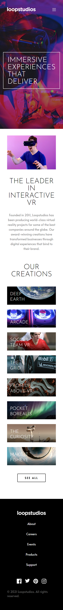
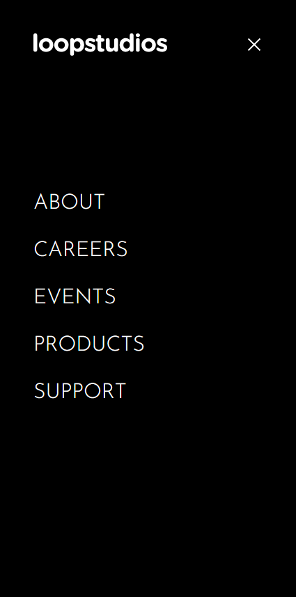

# Frontend Mentor - Loopstudios landing page solution

This is a solution to the [Loopstudios landing page challenge on Frontend Mentor](https://www.frontendmentor.io/challenges/loopstudios-landing-page-N88J5Onjw). Frontend Mentor challenges help you improve your coding skills by building realistic projects.

## Table of contents

- [Overview](#overview)
  - [The challenge](#the-challenge)
  - [Screenshot](#screenshot)
  - [Links](#links)
- [My process](#my-process)
  - [Built with](#built-with)
  - [What I learned](#what-i-learned)
  - [Useful resources](#useful-resources)
- [Author](#author)

## Overview

### The challenge

Users should be able to:

- View the optimal layout for the site depending on their device's screen size
- See hover states for all interactive elements on the page

### Screenshot

### Links

- Solution URL: [https://www.frontendmentor.io/solutions/responsive-design-built-with-tailwindcss-and-react-e44OnU_WX](https://www.frontendmentor.io/solutions/responsive-design-built-with-tailwindcss-and-react-e44OnU_WX)
- Live Site URL: [https://dreamy-pasteur-3fd6d4.netlify.app/](https://dreamy-pasteur-3fd6d4.netlify.app/)

## My process

### Built with

- HTML5
- Flexbox
- [React](https://reactjs.org/) - JS library
- [Tailwind CSS](https://tailwindcss.com/) - CSS framework

### What I learned

The main new thing that I learned was how to add background gradients using Tailwind & how to use them to make overlays for hover effects, etc.

### Useful resources

- [Tailwind CSS Docs](https://tailwindcss.com/docs) - Everything needed for use the Tailwind CSS framework.

## Author

- Website - [Yordan Hristov (Dantcho)](https://www.dantcho.com/)
- Frontend Mentor - [@DantchoLV9](https://www.frontendmentor.io/profile/DantchoLV9)
- Twitter - [@DantchoLV9](https://twitter.com/DantchoLV9)
