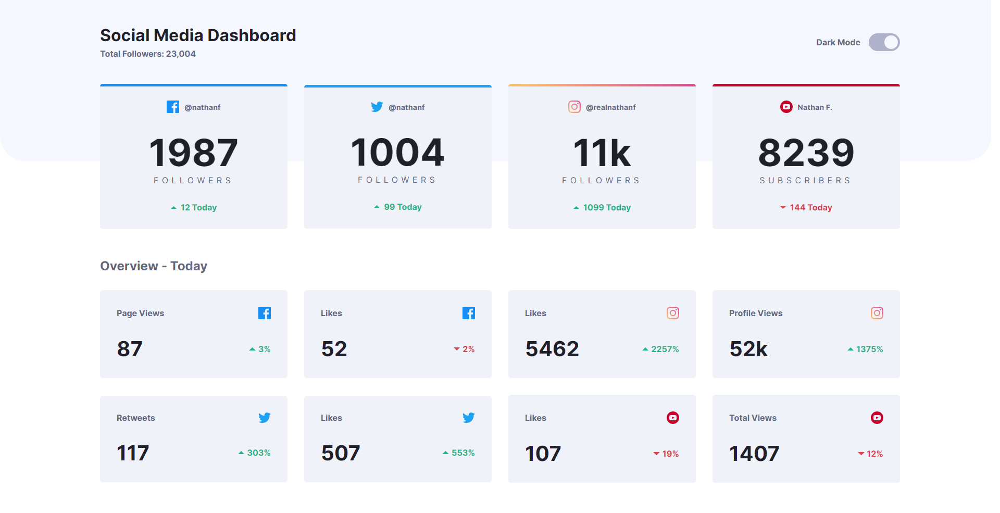
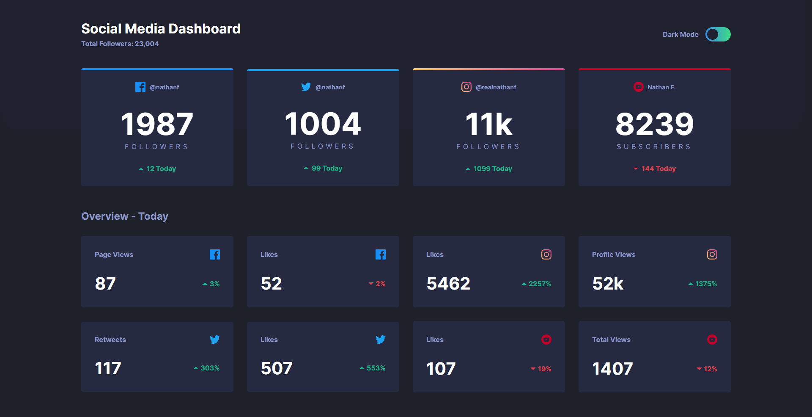

# Frontend Mentor - Social media dashboard with theme switcher solution

This is a solution to the [Social media dashboard with theme switcher challenge on Frontend Mentor](https://www.frontendmentor.io/challenges/social-media-dashboard-with-theme-switcher-6oY8ozp_H). Frontend Mentor challenges help you improve your coding skills by building realistic projects.

## Table of contents

- [Overview](#overview)
  - [The challenge](#the-challenge)
  - [Screenshot](#screenshot)
  - [Links](#links)
- [My process](#my-process)
  - [Built with](#built-with)
  - [What I learned](#what-i-learned)
  - [Continued development](#continued-development)
- [Author](#author)
- [Acknowledgments](#acknowledgments)

## Overview

### The challenge

Users should be able to:

- View the optimal layout for the site depending on their device's screen size
- See hover states for all interactive elements on the page
- Toggle color theme to their preference

### Screenshot

### Links

- Solution URL: [https://www.frontendmentor.io/solutions/social-media-dashboard-built-with-react-and-styled-components-nW5KEXtUq](https://www.frontendmentor.io/solutions/social-media-dashboard-built-with-react-and-styled-components-nW5KEXtUq)
- Live Site URL: [https://affectionate-davinci-7edbb1.netlify.app/](https://affectionate-davinci-7edbb1.netlify.app/)

## My process

### Built with

- HTML5
- Flexbox
- [React](https://reactjs.org/) - JS library
- [Styled Components](https://styled-components.com/) - For styles

### What I learned

With this project I learned how to make better light & dark theme switching functionality.

### Continued development

While I did learn a better way of making a light & dark theme switching functionality, I would like to improve on that even more and make a version without the initial flash which appears before the theme is loaded.

## Author

- Website - [Yordan Hristov (Dantcho)](https://www.dantcho.com/)
- Frontend Mentor - [@DantchoLV9](https://www.frontendmentor.io/profile/DantchoLV9)
- Twitter - [@DantchoLV9](https://twitter.com/DantchoLV9)

## Acknowledgments

I saw how to make the button for the theme switching I used in this project from [W3Schools](https://www.w3schools.com/howto/howto_css_switch.asp).
