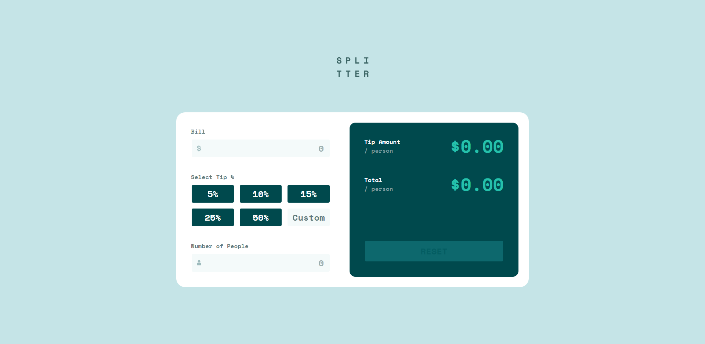

# Frontend Mentor - Tip calculator app solution

This is a solution to the [Tip calculator app challenge on Frontend Mentor](https://www.frontendmentor.io/challenges/tip-calculator-app-ugJNGbJUX). Frontend Mentor challenges help you improve your coding skills by building realistic projects.

## Table of contents

- [Overview](#overview)
  - [The challenge](#the-challenge)
  - [Screenshot](#screenshot)
  - [Links](#links)
- [My process](#my-process)
  - [Built with](#built-with)
  - [What I learned](#what-i-learned)
  - [Continued development](#continued-development)
  - [Useful resources](#useful-resources)
- [Author](#author)

## Overview

### The challenge

Users should be able to:

- View the optimal layout for the app depending on their device's screen size
- See hover states for all interactive elements on the page
- Calculate the correct tip and total cost of the bill per person

### Screenshot

### Links

- Solution URL: [https://www.frontendmentor.io/solutions/tip-calculator-app-built-with-react-and-tailwind-css-QFg0YiZ2a](https://www.frontendmentor.io/solutions/tip-calculator-app-built-with-react-and-tailwind-css-QFg0YiZ2a)
- Live Site URL: [https://stupefied-hodgkin-ff5e89.netlify.app/](https://stupefied-hodgkin-ff5e89.netlify.app/)

## My process

### Built with

- HTML5
- Flexbox
- CSS Grid
- Mobile-first workflow
- [React](https://reactjs.org/) - JS library
- [Tailwind CSS](https://tailwindcss.com/) - CSS framework

### What I learned

The main reason I built this project was to learn Tailwind CSS. It helped me learn how to use Tailwind CSS for different states like `:hover` or `:focus`. I also learned how to make responsive designs with Tailwind CSS and also use CSS Flexbox & CSS Grid.

I also used some regular expressions on this project which are always interesting.

### Continued development

I feel like at some point the structure of the app became a little bit messy. That's something I want to work on in the future.

Also at first I made the desktop design first and after finishing everything I made the design responsive. I didn't encounter any issues doing that, but I'm not sure if it's good practice.

### Useful resources

- [Tailwind CSS Docs](https://tailwindcss.com/docs) - This helped me setup Tailwind CSS & configure some of its features.
- [RegExr](https://regexr.com/) - I used this website to check that my regular expressions worked as I expected them to. **Really useful website.**

## Author

- Website - [Yordan Hristov (Dantcho)](https://www.dantcho.com/)
- Frontend Mentor - [@DantchoLV9](https://www.frontendmentor.io/profile/DantchoLV9)
- Twitter - [@DantchoLV9](https://twitter.com/DantchoLV9)
