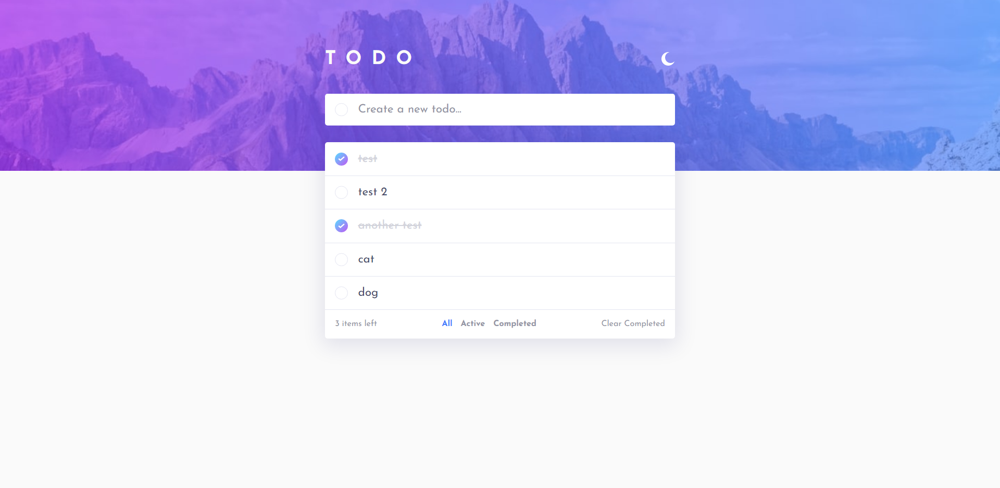
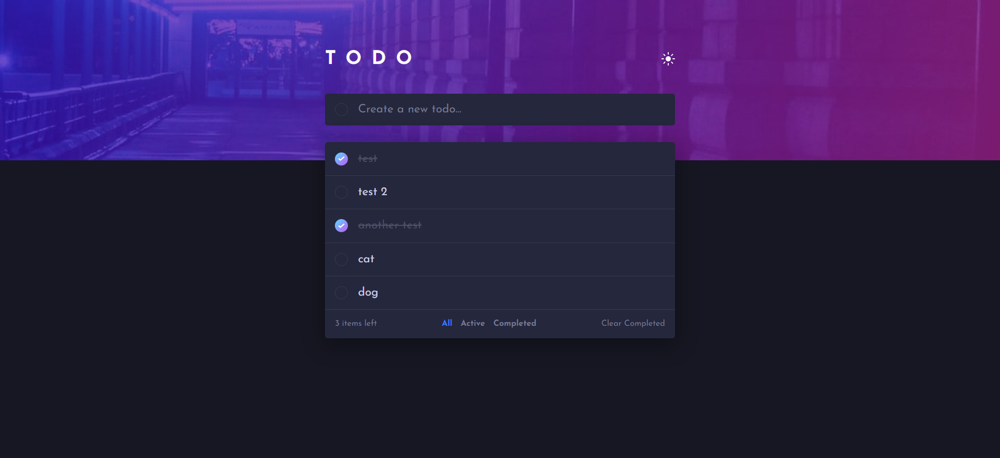

# Frontend Mentor - Todo app solution

This is a solution to the [Todo app challenge on Frontend Mentor](https://www.frontendmentor.io/challenges/todo-app-Su1_KokOW). Frontend Mentor challenges help you improve your coding skills by building realistic projects.

## Table of contents

- [Overview](#overview)
  - [The challenge](#the-challenge)
  - [Screenshot](#screenshot)
  - [Links](#links)
- [My process](#my-process)
  - [Built with](#built-with)
  - [What I learned](#what-i-learned)
  - [Continued development](#continued-development)
  - [Useful resources](#useful-resources)
- [Author](#author)

## Overview

### The challenge

Users should be able to:

- View the optimal layout for the app depending on their device's screen size
- See hover states for all interactive elements on the page
- Add new todos to the list
- Mark todos as complete
- Delete todos from the list
- Filter by all/active/complete todos
- Clear all completed todos
- Toggle light and dark mode
- **Bonus**: Drag and drop to reorder items on the list (Completed on a separate [branch](https://github.com/DantchoLV9/FrontendMentorProjects/tree/todo-app-drag-n-drop/todoapp))

### Screenshot

Light Theme Screenshot

Dark Theme Screenshot

### Links

- Solution URL: [https://www.frontendmentor.io/solutions/reactjs-todo-app-with-styled-components-lxrS6adAN](https://www.frontendmentor.io/solutions/reactjs-todo-app-with-styled-components-lxrS6adAN)
- Live Site URL: [https://gallant-easley-730f06.netlify.app/](https://gallant-easley-730f06.netlify.app/)

## My process

### Built with

- Flexbox
- [React](https://reactjs.org/) - JS library
- [Styled Components](https://styled-components.com/) - For styles
- [UUID](https://github.com/uuidjs/uuid) - For generating unique ids

### What I learned

I learned how to use props with styled components to allow for conditional rendering. Quite useful and easy to do.

I also learned how to move an element in an array from one position to another while trying to implement the drag-n-drop feature. This functionality is only available on the specified branch.

### Continued development

As mentioned I had quite a lot of issues with the drag-n-drop functionality. I used [react-beautiful-dnd](https://github.com/atlassian/react-beautiful-dnd) to implement it, so I'll definitely try it out again and maybe spend more time on it.

### Useful resources

- [Rounded Gradient Borders](https://gist.github.com/stereokai/36dc0095b9d24ce93b045e2ddc60d7a0) - This GitHub Gist really helped me with the rounded gradient border for the checkboxes.

## Author

- Website - [Yordan Hristov (Dantcho)](https://www.dantcho.com/)
- Frontend Mentor - [@DantchoLV9](https://www.frontendmentor.io/profile/DantchoLV9)
- Twitter - [@DantchoLV9](https://twitter.com/DantchoLV9)
